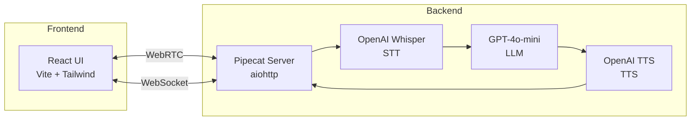

<a id="readme-top"></a>

<!-- BADGES -->
<p align="center">
  
  
  
  
  
  
  
</p>

<h1 align="center">Real-time Voice Agent with OpenAI</h1>

<p align="center">
  AI-powered voice assistant for customer support using Pipecat framework with OpenAI Whisper STT, GPT-4o, and TTS. WebRTC-based real-time communication with React UI.
</p>

---

## Table of Contents

1. [Overview](#overview)
2. [Architecture](#architecture)
3. [Technology Stack](#technology-stack)
4. [Prerequisites](#prerequisites)
5. [Quick Start](#quick-start)
6. [Docker Deployment](#docker-deployment)
7. [Manual Installation](#manual-installation)
8. [Demo Scenario](#demo-scenario)
9. [Project Structure](#project-structure)
10. [License](#license)

---

## Overview

A real-time voice agent demonstrating customer support capabilities with:

- Real-time bidirectional voice via WebRTC
- Speech-to-Text using OpenAI Whisper
- LLM responses via GPT-4o-mini
- Text-to-Speech using OpenAI TTS
- Live transcript streaming via WebSocket
- Modern React UI with navy blue theme
- Vietnamese language support

---

## Architecture



---

## Technology Stack

| Component | Technology     | Purpose                      |
| --------- | -------------- | ---------------------------- |
| Framework | Pipecat AI     | Voice pipeline orchestration |
| STT       | OpenAI Whisper | Speech-to-Text               |
| LLM       | GPT-4o-mini    | Conversation AI              |
| TTS       | OpenAI TTS     | Text-to-Speech               |
| Transport | WebRTC         | Real-time audio streaming    |
| Backend   | aiohttp        | Async HTTP server            |
| Frontend  | React + Vite   | User interface               |
| Styling   | Tailwind CSS   | UI styling                   |
| Container | Docker         | Containerization             |

---

## Prerequisites

- Python 3.10+
- Node.js 18+
- Docker & Docker Compose (optional)
- OpenAI API Key

---

## Quick Start

### Using Docker (Recommended)

```bash
# Clone repository
git clone https://github.com/YOUR_USERNAME/realtime-voice-assistant-openai.git
cd realtime-voice-assistant-openai

# Set environment variable
export OPENAI_API_KEY=your_api_key_here

# Start all services
docker-compose up --build
```

Access:

- Frontend: http://localhost:5173
- Backend: http://localhost:7860

---

## Docker Deployment

### Build and Run

```bash
# Build and start both services
docker-compose up --build

# Run in background
docker-compose up -d --build

# View logs
docker-compose logs -f

# Stop services
docker-compose down
```

### Docker Files

| File                  | Purpose                       |
| --------------------- | ----------------------------- |
| `Dockerfile`          | Backend Python container      |
| `frontend/Dockerfile` | Frontend Node/Nginx container |
| `docker-compose.yml`  | Multi-container orchestration |
| `frontend/nginx.conf` | Nginx SPA configuration       |

### Environment Variables

```bash
# Required
OPENAI_API_KEY=sk-...

# Optional (for cloud deployment)
HOST=0.0.0.0
PORT=7860
```

---

## Manual Installation

### 1. Clone Repository

```bash
git clone https://github.com/YOUR_USERNAME/realtime-voice-assistant-openai.git
cd realtime-voice-assistant-openai
```

### 2. Backend Setup

```bash
# Create virtual environment
python -m venv .venv
.venv\Scripts\activate  # Windows
# source .venv/bin/activate  # Linux/macOS

# Install dependencies
pip install -r requirements.txt

# Configure environment
cp .env.example .env
# Edit .env and add your OPENAI_API_KEY

# Start server
python main.py
```

Server runs at http://localhost:7860

### 3. Frontend Setup

```bash
cd frontend
npm install
npm run dev
```

UI runs at http://localhost:5173

---

## Usage

1. Open http://localhost:5173 in browser
2. Select audio input/output devices
3. Click "Start Conversation"
4. Speak to the voice agent in Vietnamese

---

## Demo Scenario

The voice agent demonstrates customer support with:

| Type      | Description               |
| --------- | ------------------------- |
| Product   | Product/service inquiries |
| Order     | Order status checks       |
| Technical | Technical support         |
| Complaint | Complaints and feedback   |
| General   | General questions         |

See [scenario.md](scenario.md) for detailed conversation flow.

---

## Project Structure

```
├── main.py                 # Entry point
├── Dockerfile              # Backend container
├── docker-compose.yml      # Container orchestration
├── requirements.txt        # Python dependencies
├── .env.example            # Environment template
├── src/
│   ├── bot.py              # WebRTC server & pipeline
│   ├── flow.py             # Conversation flow logic
│   └── prompt.py           # System & task prompts
├── frontend/
│   ├── Dockerfile          # Frontend container
│   ├── nginx.conf          # Nginx config
│   └── src/
│       └── App.tsx         # React UI
├── transcripts/            # Saved conversation logs
└── scenario.md             # Demo scenario docs
```

---

## License

Distributed under the MIT License. See [LICENSE](LICENSE) for details.

---

<p align="center">
  <a href="https://github.com/pipecat-ai/pipecat"></a>
  <a href="https://platform.openai.com"></a>
</p>
